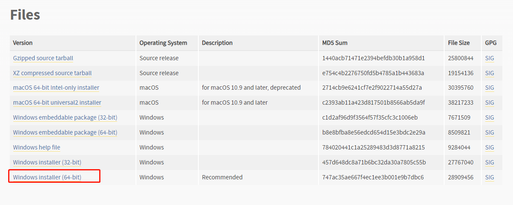
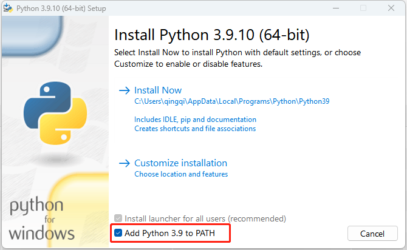
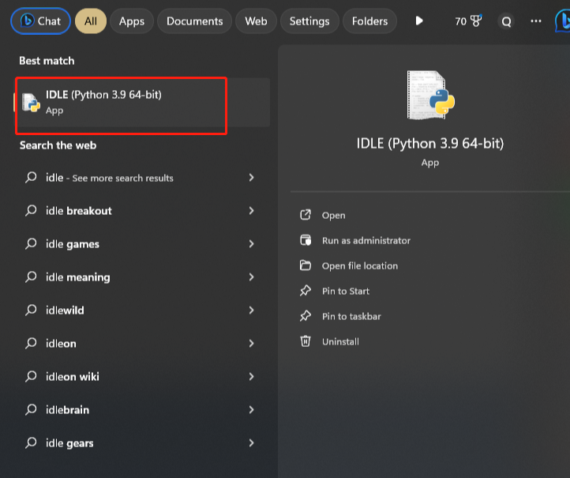
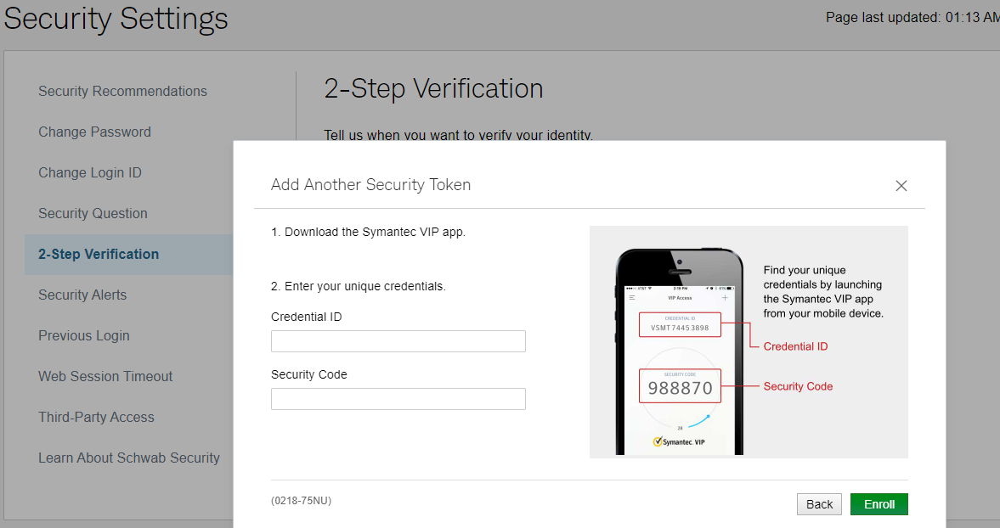
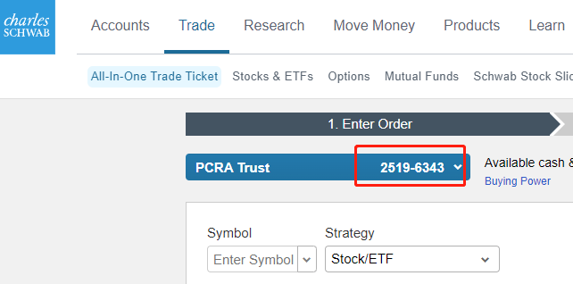

"# MT5-Schwab" 

## 使用说明

1. TelegramToMT5.py 可以接收特定 Telegram group， user的消息，作为信号来在MT5上交易标普 SPXm，Schwab 上交易股票。
2. 包含 "buy spx"的消息是买入信号。包含 "sell spx"的消息是买入信号。大小写都可以
3. 运行程序后，查看log中MT5账号是否是想要交易的账号。 如果电脑上有多个MT5终端，那么会随机选择一个MT5进行交易。所以运行程序后要确认！

## 步骤

### 安装Python
1. 下载https://www.python.org/downloads/release/python-3910/



2. 在安装的第一步选择 "Add Python3.9 to PATH"


3. 在Command Prompt 中运行命令来安装所需要的包

`pip install telethon && pip install MetaTrader5 && pip install schwab-api && python -m playwright install && pip install pyotp`

### 获取 Telegram API 密钥
1. 在 https://my.telegram.org/ 中的 API development tools 创建一个APP，然后就有api_id, api_hash。 填入**Telegram.txt**中


### 运行程序
使用IDLE, File -> Open 打开 TelegramToMT5.py


1. 第一次运行会需要在log里填写手机号， 会发送验证码到APP里，填写验证码即可。

2. 确定group id， user id, 填入**Telegram.txt**。 group id， user id 是信号来源。可以 my_event_handler1 上面使用`@client.on(events.NewMessage())`, 来接收所有消息。 在telegram发送一条消息 （如果信号不是自己，就等待信号源发送信号），然后在log 中查看log。Telegram log 示例， channel_id 是 1992922380， user_id 是 5138637335。 将channel_id 和user_id 填入**Telegram.txt**中, 注意**保存**
`message: sell spx , group id: 1992922380 , user_id: 5138637335`

3. 注释掉不需要的log，正式运行程序， 注意查看输出确定MT5信息是否正确。注意电脑不要休眠、关机。


### 交易Schwab 上的股票

1. 将enabled_schwab 变量改为1， `enabled_schwab = 1`
2. 在 https://client.schwab.com/app/access/securitysettings/#/security/verification 里设置Security token。 选择 **Always at login**, **Security token**
3. 然后添加Security Token . 先在手机上下载 **VIP Access**， 填写两个token， 用于自己在网页上登陆Schwab。然后运行**GenSecret.py**, 会有类似下面的输出

```
Your Credential ID is: SYMC0000
Your TOTP secret is: SDFWNFSN25619SDFF
Your Security Code is: 0000
```
将 Credential ID 和 Security Code 填到 Schwab 中， 将 TOTP secret 填到 Telegram.txt 中 **SCHWAB_TOTP_SECRET** 后

4. 在Telegram.txt 中填写 Schwab 的用户名 密码 账号， 账号可以在https://client.schwab.com/app/trade/tom/#/trade 找到。



