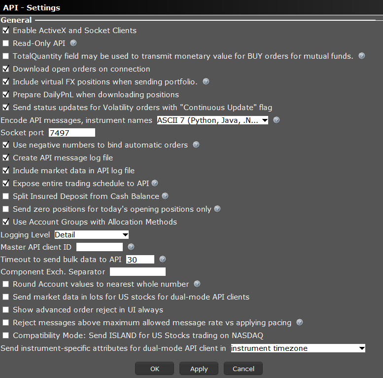

## 使用说明

1. TelegramToMT5.py 可以接收特定 Telegram group， user的消息，作为信号来在MT5上交易标普 SPXm，Schwab 上交易股票。
2. 包含 "buy spx"的消息是买入信号。包含 "sell spx"的消息是买入信号。大小写都可以
3. 运行程序后，查看log中MT5账号是否是想要交易的账号。 如果电脑上有多个MT5终端，那么会随机选择一个MT5进行交易。所以运行程序后要确认！

## 步骤

### 安装Python
1. 下载https://www.python.org/downloads/release/python-3910/


2. 在安装的第一步选择 "Add Python3.9 to PATH"


3. 在Command Prompt 中运行命令来安装所需要的包

`pip install telethon && pip install MetaTrader5 && pip install schwab-api && python -m playwright install && pip install pyotp &&  pip install pytz && pip install tzdata && pip install pandas && pip install ib-insync`

### 获取 Telegram API 密钥
1. 在 https://my.telegram.org/ 中的 API development tools 创建一个APP，然后就有api_id, api_hash。 填入**Telegram.txt**中


### 运行程序
使用IDLE, File -> Open 打开 TelegramToMT5.py


1. 第一次运行会需要在log里填写手机号， 会发送验证码到APP里，填写验证码即可。

2. 确定group id， user id, 填入**Telegram.txt**。 group id， user id 是信号来源。在代码中， my_event_handler1 上面使用`@client.on(events.NewMessage())`, 来接收所有消息。 在telegram发送一条消息 （如果信号不是自己，就等待信号源发送信号），然后查看log。

Telegram log 示例：

`message: sell spx , group id: 1992922380 , user_id: 5138637335`

group id 是 1992922380， user_id 是 5138637335。 将 group id 和 user_id 填入**Telegram.txt**中, 注意**保存**

3. 先进行测试，在MT5上登陆测试账号，Telegram.txt 中填写自己的 Telegram group id ， user id. 在telegram 中指定的group 中发送 "buy spx", "sell spx" 进行测试。

4. 通过测试后，正式运行程序， 注意查看输出确定MT5信息是否正确。注意电脑不要休眠、关机。


### 交易Schwab 上的股票

1. 将enabled_schwab 变量改为1， `enabled_schwab = 1`
2. 在 https://client.schwab.com/app/access/securitysettings/#/security/verification 里设置Security token。 选择 **Always at login**, **Security token**
3. 然后添加Security Token . 先在手机上下载 **VIP Access**， 填写两个token， 用于自己在网页上登陆Schwab。然后运行**GenSecret.py**, 会有类似下面的输出

```
Your Credential ID is: SYMC0000
Your TOTP secret is: SDFWNFSN25619SDFF
Your Security Code is: 0000
```
将 Credential ID 和 Security Code 填到 Schwab 中， 将 TOTP secret 填到 Telegram.txt 中 **SCHWAB_TOTP_SECRET** 后

4. 在Telegram.txt 中填写 Schwab 的用户名 密码 账号， 账号可以在https://client.schwab.com/app/trade/tom/#/trade 找到。


### 在Interactive 上交易

1. 安装Java https://www.oracle.com/java/technologies/downloads/#jdk21-windows

2. 在命令好中 运行 java， 如果显示没有找到命令， 就设置 environment variable https://confluence.atlassian.com/doc/setting-the-java_home-variable-in-windows-8895.html

2. 下载并安装 latest 的 TWS API 和 TWS https://www.interactivebrokers.com/en/trading/ib-api.php


3. 在 安装好的TWS API 文件夹下 {TWS API}\source\pythonclient， 运行 `python setup.py install`

4. 打开TWS， 在右上角点击设置， API -> Precations 全部选中。 API -> Settings. 按照如下设置


5. 登陆 paper account. 先在 IBKR 网页上登陆 live account。 在setting 点击 Paper Trading Account， 查看Paper Trading Username， account number 和设置密码， 填入 Telegram.txt 中。 并在TWS 上登陆paper account。

6. 运行程序， 在自己的telegram group 里 发送 'Buy spx', 'sell spx' 来测试，大小写不影响。


